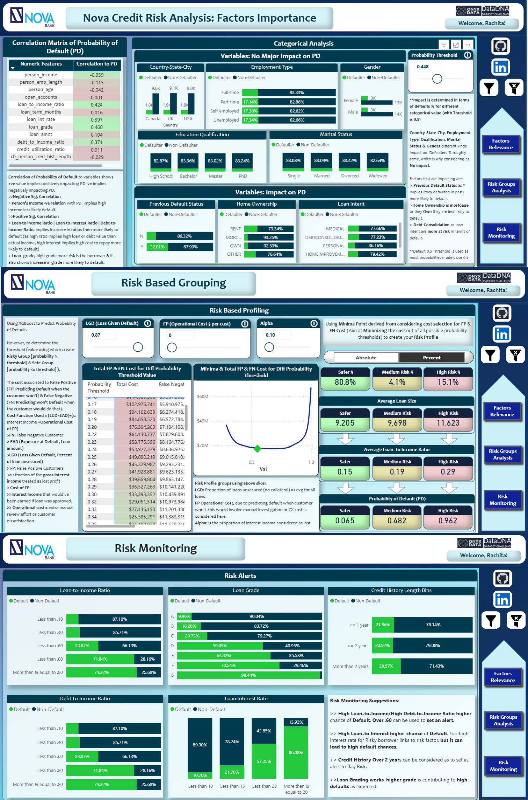

📌 Credit Risk Analytics Challenge – Nova Bank

🔹 Project Overview

This project was developed as part of the Nova Bank Credit Risk Analytics Challenge organized by Onyx Data and ZoomCharts (#DataDNA).

Nova Bank’s challenge:

👉 How to make lending fair and accessible while protecting itself from unnecessary risk.

My solution combines machine learning (XGBoost) with a Power BI dashboard and a Streamlit app to provide both predictive accuracy and business-friendly insights.

✨ In the August #DataDNA Challenge, I was recognized with the Problem Solver Title 🏆, and I am continuing to build on that recognition with this submission.

🔹 Data Preparation

    Null value imputation (category-based).
    
    Ordinal scaling, standard scaling, one-hot encoding.
    
    Power transformation for right-skewed distributions.

🔹 Modeling

    Models tested: Logistic Regression, Random Forest, XGBoost.
    
    Hyperparameter tuning with GridSearch.
    
    Optimized for F1-score (balances recall & precision) & metrics optimised to:
    Best Model: XGBoost
    Accuracy: 93%
    F1 Score: 82%
    ROC-AUC: 85.6%

⚖️ Why F1?
Dataset is imbalanced → accuracy is misleading. F1 ensures the model is neither too strict (precision-heavy, rejecting good borrowers) nor too lenient (recall-heavy, approving risky borrowers).

📌 Power BI Dashboard

Three tabs to help decision-makers:
1) Factor Importance

    Income ↓ default risk.
   
    Loan-to-income, debt-to-income, and loan-to-interest ↑ default risk.
   
    Loan Grade ↑ default risk.
   
    Past defaults & risky loan intents (debt consolidation, medical) = higher risk.
   
    Flexibility: user can select threshold → groups update dynamically.

2) Cost-Sensitive Thresholding & Risk Profiles

    Traditional 0.5 cutoff was replaced with a cost-based threshold:
    
    Total Cost
   
    Cost=(FN×LGD×EAD)+(FP×CostFPE)
   
    Total Cost= FN Cost + FP Cost = (LGD× ∑EAD)+(α× (∑ Interest Income) +OpsCost])
   
    Where:
   
        •	FN = count of missed defaulters,
       
        •	EAD = actual loan amount per FN,
       
        •	LGD = assumed recovery fraction (say 0.6), that user can select in slicer
       
        •	FP = count of wrongly rejected safe borrowers,
       
        •	OpsCost = fixed penalty for each (say $500–$1000).
       
        •   α: fraction of the gross interest income treated as lost profit or Bank Interest income share lost due to FP
   
    
    FN (False Negative) = loan approved, borrower defaults → repayment lost.
   
    
    FP (False Positive) = loan rejected though safe → lost profit + operational cost.

    📊 Risk Groups defined dynamically:
    
    Safe → PD < threshold (low-risk, auto-approve).

    Medium → near threshold (borderline, manual review).
   
    High Risky → PD > threshold (reject).

   
    Insights:
   
    Cost-sensitive threshold selector (FN & FP balance).

    Borrowers segmented into Safe, Medium, Risky.
   
    Risky = high loan size, high loan-to-income, high PD.

   
3) Risk Monitoring

    🔹Early warning indicators:

        Loan-to-Income / Debt-to-Income > 0.6
   
        High loan interest rate more likely default
   
        Credit history < 2 years
   
        Higher Loan Grade
   
        These can be tracked as alerts for proactive monitoring.

🔹 Deliverables

Power BI Dashboard → interactive insights & cost-based risk grouping.

Jupyter Notebooks → data prep, model training, threshold analysis.

🔹 Tech Stack

Python → Pandas, Scikit-learn, XGBoost, Joblib

Power BI → Interactive dashboarding

📷 Dashboard Preview 

🔹 Recognition

🏆 Problem Solver Title – August #DataDNA Challenge

🙌 Continuing the journey with the September submission.

🔹 How to Run Locally

Clone this repo:

    git clone https://github.com/your-username/Onyx-Data-Challenge-Sept25
    cd Onyx-Data-Challenge-Sept25

Install dependencies: pip install -r requirements.txt

Run Streamlit app: WIP streamlit run app.py

Open Power BI dashboard from /dashboard.

🔹 Acknowledgements

Thanks to @OnyxData, @ZoomCharts, @Smart Frames UI, @Data Career Jumpstart for organizing the #DataDNA challenges and fostering this amazing community.
